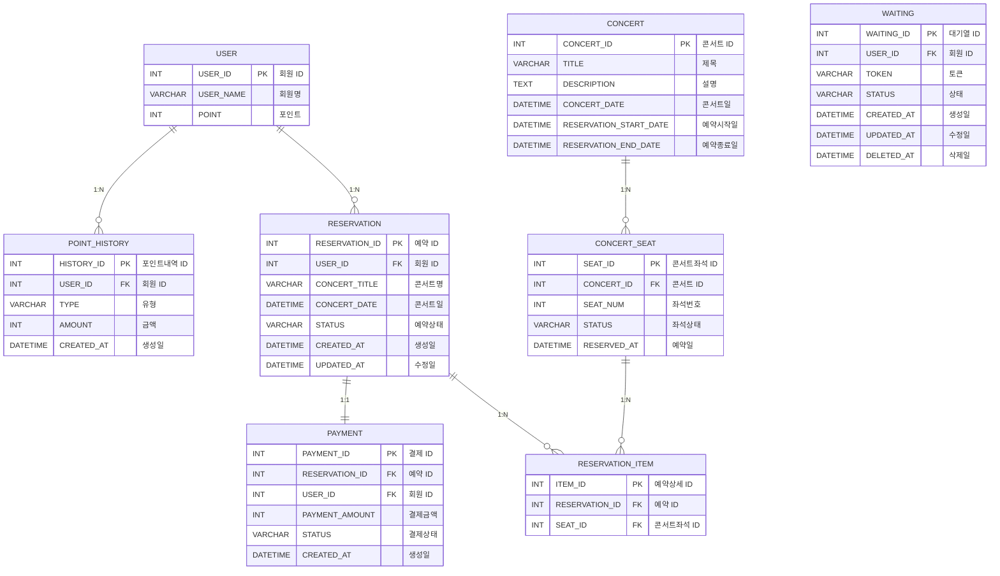

## ERD

```mermaid
erDiagram
    USER {
        INT USER_ID PK "회원 ID"
        VARCHAR USER_NAME "회원명"
        INT POINT "포인트"
    }

    POINT_HISTORY {
        INT HISTORY_ID PK "포인트내역 ID"
        INT USER_ID FK "회원 ID"
        VARCHAR TYPE "유형"
        INT AMOUNT "금액"
        DATETIME CREATED_AT "생성일"
    }

    CONCERT {
        INT CONCERT_ID PK "콘서트 ID"
        VARCHAR TITLE "제목"
        TEXT DESCRIPTION "설명"
        DATETIME CONCERT_DATE "콘서트일"
        DATETIME RESERVATION_START_DATE "예약시작일"
        DATETIME RESERVATION_END_DATE "예약종료일"
    }

    CONCERT_SEAT {
        INT SEAT_ID PK "콘서트좌석 ID"
        INT CONCERT_ID FK "콘서트 ID"
        INT SEAT_NUM "좌석번호"
        VARCHAR STATUS "좌석상태"
        DATETIME RESERVED_AT "예약일"
    }

    RESERVATION {
        INT RESERVATION_ID PK "예약 ID"
        INT USER_ID FK "회원 ID"
        VARCHAR CONCERT_TITLE "콘서트명"
        DATETIME CONCERT_DATE "콘서트일"
        VARCHAR STATUS "예약상태"
        DATETIME CREATED_AT "생성일"
        DATETIME UPDATED_AT "수정일"
    }

    RESERVATION_ITEM {
        INT ITEM_ID PK "예약상세 ID"
        INT RESERVATION_ID FK "예약 ID"
        INT SEAT_ID FK "콘서트좌석 ID"
    }

    PAYMENT {
        INT PAYMENT_ID PK "결제 ID"
        INT RESERVATION_ID FK "예약 ID"
        INT USER_ID FK "회원 ID"
        INT PAYMENT_AMOUNT "결제금액"
        VARCHAR STATUS "결제상태"
        DATETIME CREATED_AT "생성일"
    }

    WAITING {
        INT WAITING_ID PK "대기열 ID"
        INT USER_ID FK "회원 ID"
        VARCHAR TOKEN "토큰"
        VARCHAR STATUS "상태"
        DATETIME CREATED_AT "생성일"
        DATETIME UPDATED_AT "수정일"
        DATETIME DELETED_AT "삭제일"
    }

    USER ||--o{ POINT_HISTORY : "1:N"
    USER ||--o{ RESERVATION : "1:N"
    RESERVATION ||--o{ RESERVATION_ITEM : "1:N"
    RESERVATION ||--|| PAYMENT : "1:1"
    CONCERT ||--o{ CONCERT_SEAT : "1:N"
    CONCERT_SEAT ||--o{ RESERVATION_ITEM : "1:N"
```
