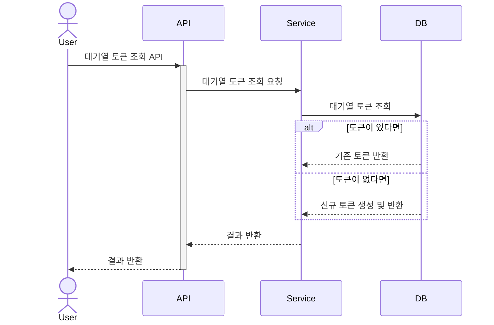
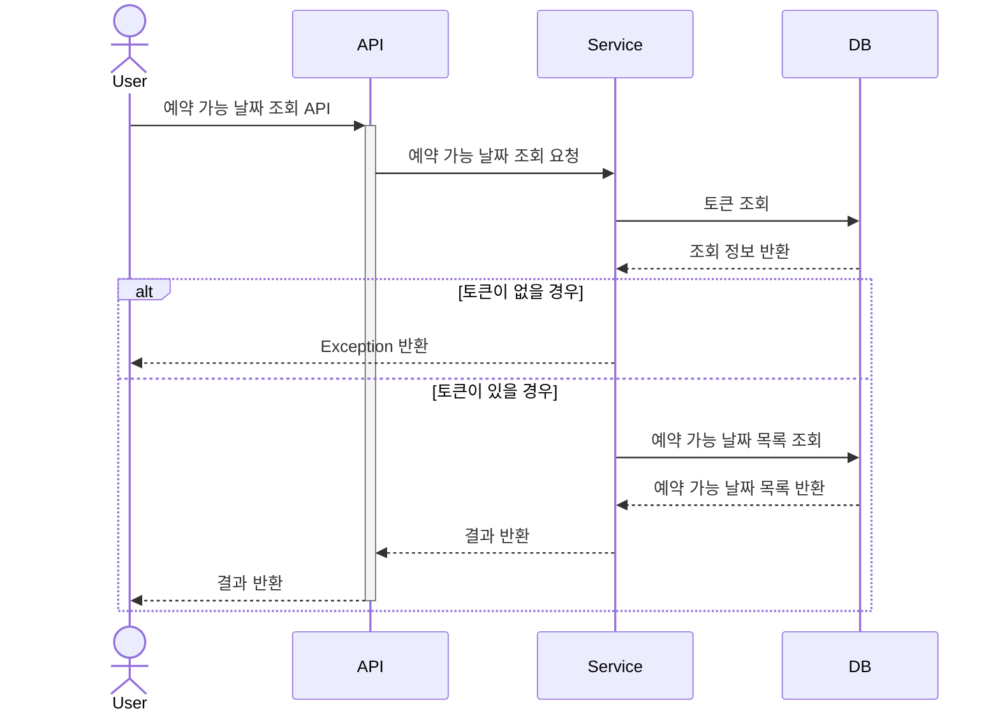
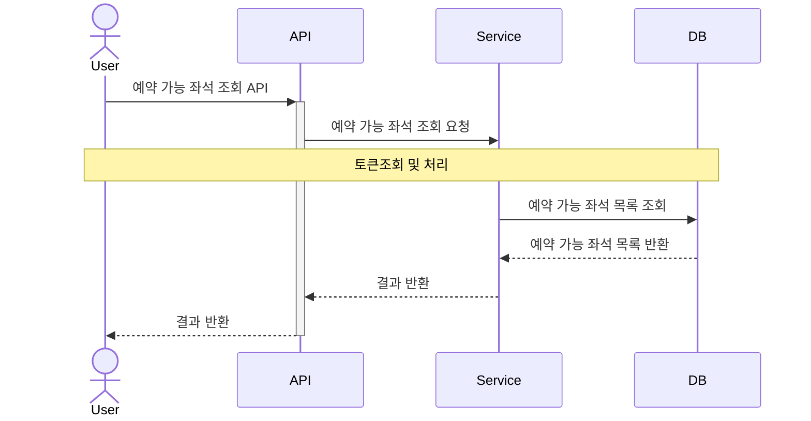
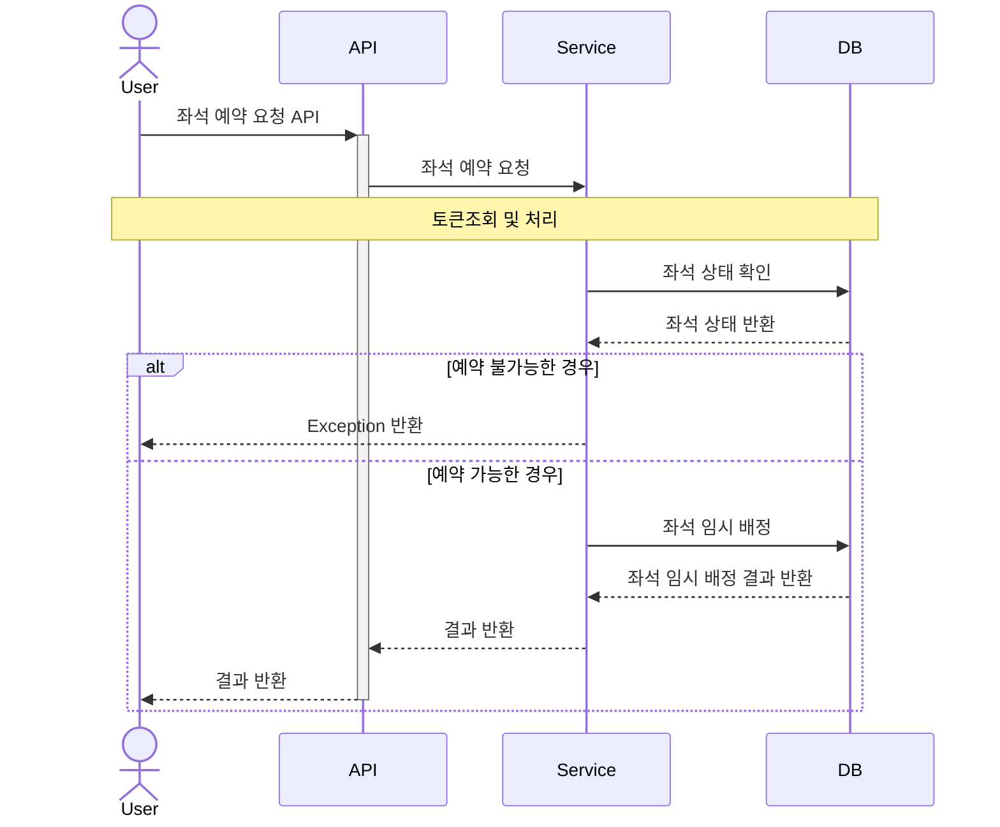
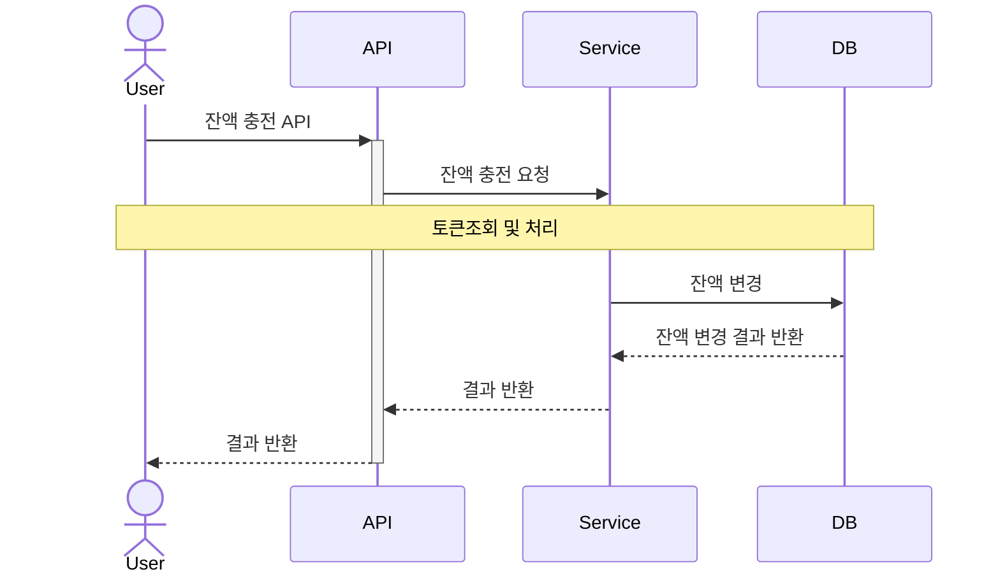
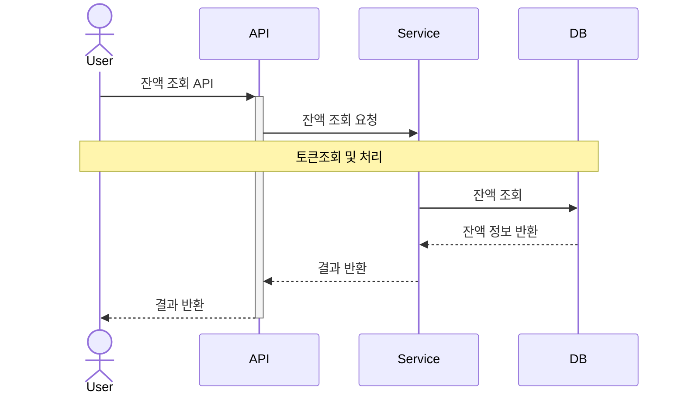
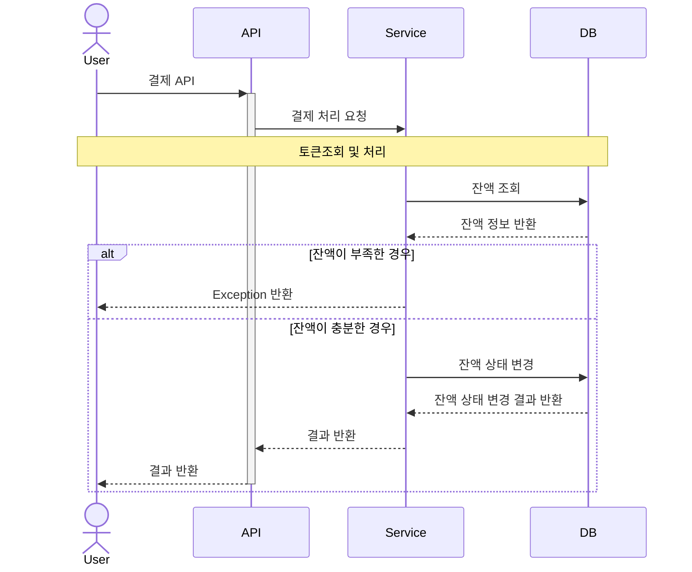

## 시퀀스 다이어그램

### 대기열 토큰 조회 API

```mermaid
sequenceDiagram
    actor User
    
    User->>+API: 대기열 토큰 조회 API
    API->>Service: 대기열 토큰 조회 요청
    Service->>DB: 대기열 토큰 조회
    alt 토큰이 있다면
        DB-->>Service: 기존 토큰 반환
    else 토큰이 없다면
        DB-->>Service: 신규 토큰 생성 및 반환
    end
    Service-->>API: 결과 반환
    API-->>-User: 결과 반환
```

 

### 예약가능 날짜 조회 API

```mermaid
sequenceDiagram
    actor User

    User->>+API: 예약 가능 날짜 조회 API
    API->>Service: 예약 가능 날짜 조회 요청
    Service->>DB: 토큰 조회
    DB-->>Service: 조회 정보 반환
    alt 토큰이 없을 경우
        Service-->>User: Exception 반환
    else 토큰이 있을 경우
        Service->>DB: 예약 가능 날짜 목록 조회
        DB-->>Service: 예약 가능 날짜 목록 반환
        Service-->>API: 결과 반환
        API-->>-User: 결과 반환
    end
```

 

### 예약 가능 좌석 조회 API

```mermaid
sequenceDiagram
    actor User

    User->>+API: 예약 가능 좌석 조회 API
    API->>Service: 예약 가능 좌석 조회 요청

    Note over User, DB: 토큰조회 및 처리

    Service->>DB: 예약 가능 좌석 목록 조회
    DB-->>Service: 예약 가능 좌석 목록 반환
    Service-->>API: 결과 반환
    API-->>-User: 결과 반환
```

 

### 좌석 예약 요청 API

```mermaid
sequenceDiagram
    actor User
    
    User->>+API: 좌석 예약 요청 API
    API->>Service: 좌석 예약 요청

    Note over User, DB: 토큰조회 및 처리

    Service->>DB: 좌석 상태 확인
    DB-->>Service: 좌석 상태 반환
    alt 예약 불가능한 경우
        Service-->>User: Exception 반환
    else 예약 가능한 경우
        Service->>DB: 좌석 임시 배정
        DB-->>Service: 좌석 임시 배정 결과 반환
        Service-->>API: 결과 반환
        API-->>-User: 결과 반환
    end
```

 

### 잔액 충전  API

```mermaid
sequenceDiagram
    actor User
    
    User->>+API: 잔액 충전 API
    API->>Service: 잔액 충전 요청

    Note over User, DB: 토큰조회 및 처리

    Service->>DB: 잔액 변경
    DB-->>Service: 잔액 변경 결과 반환
    Service-->>API: 결과 반환
    API-->>-User: 결과 반환
```

 

### 잔액 조회 API

```mermaid
sequenceDiagram
    actor User

    User->>+API: 잔액 조회 API
    API->>Service: 잔액 조회 요청

    Note over User, DB: 토큰조회 및 처리
    
    Service->>DB: 잔액 조회
    DB-->>Service: 잔액 정보 반환
    Service-->>API: 결과 반환
    API-->>-User: 결과 반환
```

 

### 결제 API

```mermaid
sequenceDiagram
    actor User
    
    User->>+API: 결제 API
    API->>Service: 결제 처리 요청
    
    Note over User, DB: 토큰조회 및 처리
    
    Service->>DB: 잔액 조회
    DB-->>Service: 잔액 정보 반환
    alt 잔액이 부족한 경우 
        Service-->>User: Exception 반환
    else 잔액이 충분한 경우
        Service->>DB: 잔액 상태 변경
        DB-->>Service: 잔액 상태 변경 결과 반환
        Service-->>API: 결과 반환
        API-->>-User: 결과 반환
    end
```
